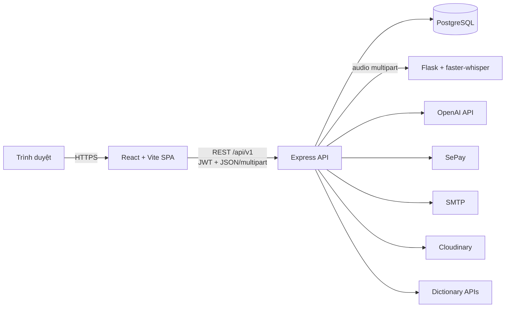
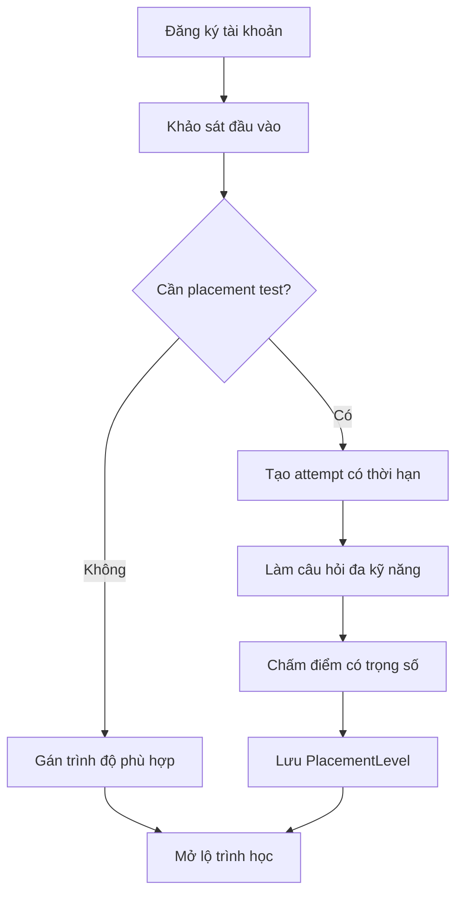
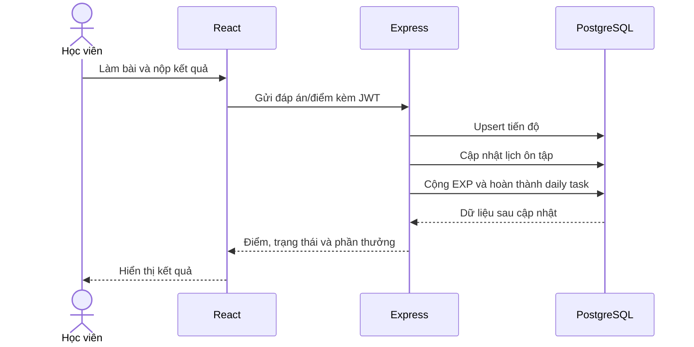
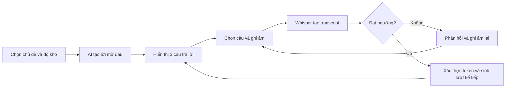
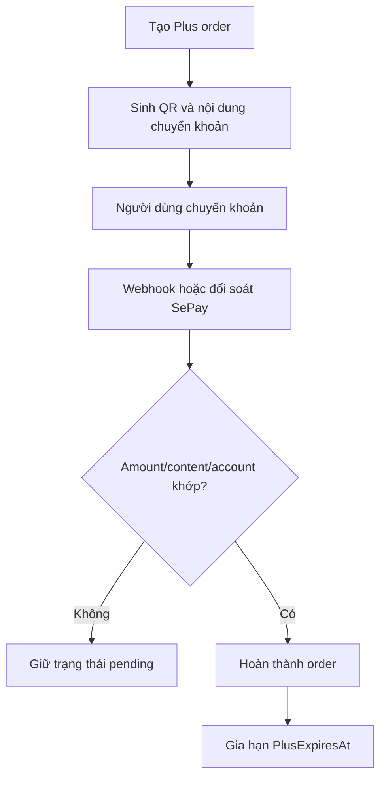

<p align="center">
  
</p>

<h1 align="center">LingoConnect</h1>

<p align="center">
  Nền tảng tự học tiếng Anh full-stack với lộ trình theo trình độ, bài học bốn kỹ năng,
  luyện nói bằng Whisper, hội thoại AI, spaced repetition và hệ thống quản trị nội dung.
</p>

<p align="center">
  
  
  
  
  
  
</p>

<p align="center">
  
</p>

---

## Mục lục

- [Tổng quan](#tổng-quan)
- [Tính năng hệ thống](#tính-năng-hệ-thống)
- [Kiến trúc](#kiến-trúc)
- [Luồng nghiệp vụ chính](#luồng-nghiệp-vụ-chính)
- [API](#api)
- [Công nghệ](#công-nghệ)
- [Cấu trúc mã nguồn](#cấu-trúc-mã-nguồn)
- [Cài đặt và chạy local](#cài-đặt-và-chạy-local)
- [Dữ liệu mẫu](#dữ-liệu-mẫu)
- [Kiểm thử](#kiểm-thử)
- [Triển khai](#triển-khai)
- [Bảo mật và giới hạn](#bảo-mật-và-giới-hạn)

## Tổng quan

**LingoConnect** là ứng dụng web hỗ trợ người học rèn luyện tiếng Anh trên một nền tảng thống nhất. Sau khi đăng ký, người học thực hiện khảo sát hoặc bài kiểm tra đầu vào để xác định điểm bắt đầu. Hệ thống sau đó mở nội dung phù hợp, ghi nhận tiến độ, tạo nhiệm vụ hằng ngày và lên lịch ôn tập.

Ba nhóm truy cập chính:

| Vai trò | Khả năng chính |
| --- | --- |
| Khách | Xem landing page, đăng ký, đăng nhập và đặt lại mật khẩu qua email. |
| Học viên | Làm placement test, học bốn kỹ năng, ngữ pháp, từ vựng, mini-game, nhiệm vụ ngày và theo dõi tiến độ. |
| Quản trị viên | Theo dõi dashboard, quản lý tài khoản, nội dung học, game, thông báo và yêu cầu hỗ trợ. |

Gói **Plus** là trạng thái thuê bao của học viên, không phải một role riêng. Tài khoản Plus được truy cập Listening, Speaking và Speaking AI trong thời hạn còn hiệu lực.

### Các màn hình frontend chính

| Route | Chức năng |
| --- | --- |
| `/`, `/login`, `/register`, `/forgot-password` | Landing page và xác thực tài khoản. |
| `/onboarding` | Khảo sát và kiểm tra đầu vào. |
| `/dashboard`, `/daily-tasks` | Tổng quan học tập và nhiệm vụ hằng ngày. |
| `/courses`, `/skill/:type` | Danh sách khóa học và lộ trình kỹ năng. |
| `/listening/lessons/*`, `/reading/lessons/*` | Bài nghe và bài đọc. |
| `/speaking/options`, `/speaking/lessons/*` | Luyện nói theo bài có sẵn. |
| `/speaking/ai`, `/speaking/personalized/:sessionId` | Tạo và thực hành hội thoại AI. |
| `/writing/lessons/*`, `/grammar` | Luyện viết và ngữ pháp. |
| `/dictionary`, `/vocabulary` | Từ điển và bộ sưu tập từ vựng. |
| `/games`, `/games/play/:levelId` | Mini-game theo cấp độ. |
| `/settings`, `/support` | Tài khoản, gói Plus và hỗ trợ. |
| `/admin/*` | Khu vực quản trị. |

## Tính năng hệ thống

### Xác thực và tài khoản

- Đăng ký bằng tên người dùng, email và mật khẩu.
- Đăng nhập bằng JWT Bearer token; mật khẩu được băm bằng bcrypt.
- Kiểm tra lại trạng thái tài khoản trong database ở mỗi request được bảo vệ.
- Đặt lại mật khẩu bằng mã xác nhận gửi qua SMTP.
- Cập nhật tên hiển thị, avatar, mật khẩu và trạng thái học tập.
- Phân tách khu vực học viên và quản trị viên bằng middleware role.

### Onboarding và xếp lớp

- Khảo sát mục tiêu và trình độ tự đánh giá.
- Xếp lớp trực tiếp cho trường hợp phù hợp hoặc tạo placement attempt có thời hạn.
- Câu hỏi kết hợp Listening, Reading, Speaking, Writing và mini-game.
- Attempt gắn với đúng tài khoản; backend kiểm tra token, đáp án và thời gian hết hạn.
- Kết quả cập nhật `PlacementLevel`, nguồn xếp lớp và nội dung được phép truy cập.

### Bốn kỹ năng và ngữ pháp

| Module | Nội dung | Dữ liệu tiến độ |
| --- | --- | --- |
| Listening | Hội thoại, speaker, transcript segment, audio, câu hỏi và từ vựng. | Trạng thái, điểm và lần cập nhật gần nhất. |
| Reading | Bài đọc nhiều đoạn, câu hỏi và từ vựng. | Trạng thái và điểm. |
| Speaking | Câu mẫu, lựa chọn trả lời, ghi âm và chấm mức khớp. | Trạng thái và điểm. |
| Writing | Bài học, câu dịch, từ gợi ý và phản hồi sửa câu. | Trạng thái và điểm. |
| Grammar | Danh mục, chủ đề lý thuyết và quiz. | Điểm tốt nhất, lần làm và trạng thái. |

Khi hoàn thành nội dung, backend có thể đồng thời cập nhật progress, cộng EXP, hoàn thành daily task và tạo lịch ôn tập.

### Nhận dạng giọng nói và Speaking AI

- Trình duyệt ghi âm bằng `MediaRecorder` và gửi audio dạng multipart.
- Express chuyển tệp sang Flask Whisper service.
- `faster-whisper` tạo transcript tiếng Anh.
- Backend chuẩn hóa câu, căn chỉnh từ và trả điểm cùng danh sách từ thiếu/thừa.
- Người dùng Plus có thể tạo hội thoại theo chủ đề và độ khó.
- Mỗi lượt hội thoại cung cấp ba câu trả lời; người học chọn câu, ghi âm và phải đạt ngưỡng trước khi chuyển lượt.
- State token, option hash và history hash giúp phát hiện lịch sử hoặc lựa chọn bị sửa ở phía client.
- Phiên Speaking AI được lưu trong trình duyệt trong 24 giờ; backend không phụ thuộc session trong memory.

### Writing AI

- Tính độ tương đồng cục bộ để xử lý nhanh câu đúng rõ ràng hoặc sai rõ ràng.
- Gọi OpenAI cho trường hợp cần phản hồi ngôn ngữ linh hoạt.
- Chuẩn hóa kết quả AI thành điểm, câu sửa và nhận xét.
- Có timeout, cache và thuật toán chấm cục bộ khi dịch vụ AI không sẵn sàng.

### Từ điển và từ vựng

- Tra Anh–Việt và Việt–Anh bằng các API từ điển công cộng.
- Gợi ý từ với Datamuse; lấy định nghĩa/phát âm và bản dịch khi khả dụng.
- Từ điển hoạt động theo API, không lưu lịch sử tra cứu vào PostgreSQL.
- Tạo bộ sưu tập từ cá nhân, thêm/sửa/xóa từ và luyện ôn tập.
- Gửi bộ sưu tập công khai để quản trị viên xét duyệt.

### Gamification, nhiệm vụ ngày và spaced repetition

- EXP, level, streak và tổng thời gian học.
- Mini-game theo level với điểm, sao, thời gian và số lần thử.
- Nhiệm vụ hằng ngày ưu tiên nội dung đến hạn trước nội dung mới.
- Chọn task có độ đa dạng kỹ năng và tránh trùng mục tiêu trong cùng ngày.
- Lịch ôn gần với SM-2: quality 0–5, mốc 1 ngày, 6 ngày và khoảng cách theo ease factor.
- Lưu item ôn tập và lịch sử từng lần review.

### Plus và thanh toán SePay

- Tạo yêu cầu thanh toán và nội dung chuyển khoản duy nhất.
- Sinh QR từ cấu hình ngân hàng.
- Nhận webhook hoặc chủ động đối soát giao dịch SePay.
- Chỉ hoàn thành order khi số tiền, nội dung và tài khoản nhận khớp.
- Gia hạn `PlusExpiresAt` cho cả tài khoản mới nâng cấp và tài khoản đang Plus.
- Giá và thời hạn được cấu hình qua biến môi trường.

### Thông báo, hỗ trợ và quản trị

- Thông báo trong ứng dụng cho một hoặc nhiều học viên.
- Ticket hỗ trợ có hội thoại hai chiều và tệp đính kèm.
- Dashboard quản trị dùng số liệu thật từ database: tài khoản, nội dung, thời gian học, top học viên và nhóm cần chú ý.
- CRUD bài học, câu hỏi, từ vựng, speaker, transcript, paragraph, game level và placement question.
- Quản lý tài khoản, khóa/mở, đổi mật khẩu, tặng ngày Plus và xem chi tiết tiến độ.

## Kiến trúc

### Sơ đồ tổng thể



### Backend

Backend được tổ chức theo luồng chính:

```text
Route -> Middleware -> Controller -> Service/Repository -> PostgreSQL hoặc dịch vụ ngoài
```

- `route`: định nghĩa endpoint và middleware bảo vệ.
- `middleware`: JWT, role, Plus, upload, validation và error handler.
- `controller`: nhận request và chuẩn hóa response.
- `service/repository`: xử lý nghiệp vụ, transaction và truy vấn dữ liệu.
- `database.js`: PostgreSQL pool và adapter tham số có tên.

Whisper chạy như một HTTP service riêng về mặt logic. Dockerfile có thể chạy Express và Whisper cùng container; khi deploy Express riêng, cấu hình `WHISPER_SERVER_URL` trỏ tới dịch vụ Whisper bên ngoài.

### Frontend

- React Router phân tách public route, learner route, Plus route và admin route.
- `AuthContext` quản lý phiên JWT và thông tin người dùng.
- Axios interceptor tự gắn Bearer token và xử lý phiên hết hạn.
- API client được chia theo module nghiệp vụ.
- Audio playback được quản lý tập trung để tránh nhiều nguồn phát đồng thời.

## Luồng nghiệp vụ chính

### 1. Xếp lớp và mở nội dung



### 2. Hoàn thành bài học



### 3. Một lượt Speaking AI



### 4. Nâng cấp Plus



## API

Base URL mặc định: `http://localhost:5000/api/v1`.

| Module | Prefix | Chức năng chính |
| --- | --- | --- |
| Health | `/health` | Kiểm tra trạng thái Express API. |
| Auth | `/auth` | Đăng ký, đăng nhập, current user, quên/đặt lại mật khẩu. |
| Users | `/users` | Hồ sơ, avatar, mật khẩu, stats và reset tiến độ. |
| Onboarding | `/onboarding` | Survey, placement attempt, kiểm tra và nộp bài. |
| Dashboard | `/dashboard` | Tổng quan học tập của học viên. |
| Listening | `/listening` | Danh sách bài, chi tiết và lưu progress. |
| Reading | `/reading` | Danh sách bài, chi tiết và lưu progress. |
| Speaking | `/speaking` | Bài nói, transcription, chấm nói và hội thoại AI. |
| Writing | `/writing` | Bài viết, chấm câu và lưu progress. |
| Grammar | `/grammar` | Danh mục, chủ đề và quiz attempt. |
| Dictionary | `/dictionary` | Search, autocomplete và dịch câu. |
| Collections | `/collections` | Bộ sưu tập từ, public submission và review. |
| Games | `/games` | Level, câu hỏi và nộp kết quả. |
| Gamification | `/gamification` | Stats và EXP. |
| Daily tasks | `/daily-tasks` | Kế hoạch hôm nay và hoàn thành nhiệm vụ. |
| Study time | `/study-time` | Heartbeat thời gian học chủ động. |
| Billing | `/billing` | Subscription, Plus order và SePay webhook. |
| Support | `/support` | Ticket và tin nhắn hỗ trợ. |
| Notifications | `/notifications` | Danh sách và trạng thái đã đọc. |
| Admin | `/admin` | Dashboard, nội dung, tài khoản, game và hỗ trợ. |

Các route nghiệp vụ yêu cầu JWT, ngoại trừ auth public, health check và SePay webhook. Quyền learner, admin và Plus tiếp tục được kiểm tra ở backend; frontend guard chỉ phục vụ điều hướng giao diện.

## Công nghệ

| Tầng | Công nghệ |
| --- | --- |
| Frontend | React 18, React Router 6, Vite 5, Axios, Framer Motion, React Hot Toast, React Icons |
| Rich text và HTML | React Quill, DOMPurify |
| Backend | Node.js 22, Express 4, Helmet, CORS, Morgan, Multer |
| Database | PostgreSQL, `pg` pool |
| Xác thực | JWT, bcryptjs, express-validator |
| Nhận dạng tiếng nói | Python 3.11, Flask, faster-whisper, FFmpeg |
| AI | OpenAI Chat Completions API |
| Media | Cloudinary |
| Email và thanh toán | Nodemailer/SMTP, SePay |
| Kiểm thử | Node.js built-in test runner |
| Triển khai | Docker, Railpack/Railway, Vercel |

## Cấu trúc mã nguồn

```text
tiengAnh/
├── frontend/
│   ├── public/                  # favicon, icon và ảnh landing page
│   ├── src/
│   │   ├── api/                 # Axios client theo module
│   │   ├── components/          # Common, layout và màn hình bài học
│   │   ├── contexts/            # AuthContext
│   │   ├── hooks/               # Auth, debounce, study-time tracker
│   │   ├── pages/               # Trang public và học viên
│   │   ├── pages/admin/         # Trang quản trị
│   │   ├── styles/              # CSS theo nhóm chức năng
│   │   └── App.jsx              # Route frontend
│   ├── package.json
│   └── vercel.json
├── backend/
│   ├── src/
│   │   ├── config/              # Database, JWT và CORS
│   │   ├── middlewares/         # Auth, role, Plus, upload, validation
│   │   ├── modules/             # Module nghiệp vụ
│   │   ├── repositories/        # Lớp truy cập dữ liệu dùng lại
│   │   └── app.js               # Express app và API mount
│   ├── scripts/                 # Kiểm tra schema, dữ liệu và import dump
│   ├── test/                    # Backend tests
│   ├── server.js                # Entry point Express
│   ├── whisper_server.py        # Flask Whisper service
│   ├── Dockerfile
│   └── package.json
├── baocao/                      # Báo cáo đồ án
├── cosodulieu.sql               # PostgreSQL schema và dữ liệu khởi tạo
└── README.md
```

## Cài đặt và chạy local

### Yêu cầu

| Công cụ | Phiên bản khuyến nghị |
| --- | --- |
| Node.js | 22.x |
| npm | 10.x hoặc mới hơn |
| PostgreSQL | 18.x để tương thích trực tiếp với dump hiện tại |
| Python | 3.11 |
| FFmpeg | Bắt buộc nếu chạy Whisper local |

### 1. Clone repository

```bash
git clone https://github.com/longmaychem36/tiengAnh.git
cd tiengAnh
```

### 2. Khôi phục PostgreSQL

Tạo database rỗng rồi import dump:

```bash
createdb -U postgres EnglishLearningSystem
psql -U postgres -d EnglishLearningSystem -f cosodulieu.sql
```

Có thể kiểm tra dump mà không ghi dữ liệu:

```bash
cd backend
npm ci
npm run db:import-data:check
```

### 3. Cấu hình backend

Sao chép `backend/.env.example` thành `backend/.env` và điền tối thiểu:

```env
NODE_ENV=development
PORT=5000
CLIENT_URL=http://localhost:5173

DB_HOST=localhost
DB_PORT=5432
DB_NAME=EnglishLearningSystem
DB_USER=postgres
DB_PASSWORD=your_password
DB_SSL=false

JWT_SECRET=replace_with_a_long_random_secret
JWT_EXPIRES_IN=7d
```

Các tích hợp tùy chọn:

```env
# OpenAI
OPENAI_API_KEY=
OPENAI_BASE_URL=https://api.openai.com/v1
OPENAI_MODEL=gpt-4o-mini
SPEAKING_OPENAI_MODEL=gpt-4o-mini
WRITING_OPENAI_MODEL=gpt-4o-mini

# Whisper
WHISPER_SERVER_URL=http://127.0.0.1:5001
WHISPER_MODEL=small
WHISPER_DEVICE=cpu
WHISPER_COMPUTE=int8
WHISPER_PORT=5001

# Cloudinary
CLOUDINARY_CLOUD_NAME=
CLOUDINARY_API_KEY=
CLOUDINARY_API_SECRET=

# SMTP
APP_NAME=LingoConnect
MAIL_FROM=
SMTP_HOST=
SMTP_PORT=587
SMTP_SECURE=false
SMTP_USER=
SMTP_PASS=

# Plus và SePay
PLUS_PRICE_VND=2000
PLUS_DURATION_DAYS=30
SEPAY_BANK_CODE=
SEPAY_ACCOUNT_NUMBER=
SEPAY_ACCOUNT_NAME=
SEPAY_WEBHOOK_API_KEY=
SEPAY_API_TOKEN=
```

Không commit `.env`, database URL hoặc khóa dịch vụ vào repository.

### 4. Cài dependencies

Backend và Whisper:

```bash
cd backend
npm ci
pip install -r requirements.txt
```

Frontend:

```bash
cd frontend
npm ci
```

### 5. Chạy ứng dụng

Terminal backend:

```bash
cd backend
npm run dev
```

Terminal Whisper:

```bash
cd backend
python whisper_server.py
```

Terminal frontend:

```bash
cd frontend
npm run dev
```

Hoặc chạy Express và Whisper cùng lúc:

```bash
cd backend
npm run dev:all
```

| Thành phần | URL mặc định |
| --- | --- |
| Frontend | `http://localhost:5173` |
| Express API | `http://localhost:5000/api/v1` |
| Health check | `http://localhost:5000/api/v1/health` |
| Whisper | `http://localhost:5001` |

Frontend mặc định gọi `http://localhost:5000/api/v1`. Có thể ghi đè bằng `frontend/.env`:

```env
VITE_API_URL=http://localhost:5000/api/v1
```

## Dữ liệu mẫu

`cosodulieu.sql` chứa 41 bảng, đầy đủ nội dung học hiện tại và một lượng nhỏ tiến độ mẫu. Nội dung chính gồm:

- 3 mức trình độ.
- 18 chủ đề ngữ pháp và 270 câu quiz.
- 10 bài cho mỗi kỹ năng Listening, Reading, Speaking và Writing.
- 12 cấp mini-game với 144 câu hỏi.
- 2 tài khoản quản trị và 3 học viên mẫu.

### Tài khoản khởi tạo

| Loại | Email | Mật khẩu |
| --- | --- | --- |
| Admin chính | `admin.primary@system.com` | `Admin@123` |
| Admin | `admin@system.com` | `Admin@123` |
| Học viên Basic | `hocvien.basic@example.com` | `User@123` |
| Học viên Intermediate | `hocvien.intermediate@example.com` | `User@123` |
| Học viên Advanced | `hocvien.advanced@example.com` | `User@123` |

> Các mật khẩu trên chỉ dùng để khởi tạo môi trường. Hãy đổi hoặc xóa tài khoản mẫu trước khi triển khai thật.

### Nhóm bảng chính

| Nhóm | Bảng tiêu biểu |
| --- | --- |
| Tài khoản | `Users`, `LearningLevels`, `UserStats`, `PasswordResetCodes` |
| Bốn kỹ năng | `Listening*`, `Reading*`, `Speaking*`, `Writing*` |
| Ngữ pháp | `GrammarCategories`, `GrammarTopics`, `GrammarQuiz`, `GrammarProgress` |
| Game và placement | `GameLevels`, `MiniGameQuestions`, `PlacementMiniGameQuestions`, `UserGameProgress` |
| Từ vựng | `UserCollections`, `UserCollectionWords` |
| Nhiệm vụ và ôn tập | `DailyTasks`, `StudyTimeDaily`, `SpacedRepetitionItems`, `SpacedRepetitionReviews` |
| Hệ thống | `Notifications`, `NotificationRecipients`, `SupportTickets`, `SupportTicketMessages` |
| Thanh toán | `PaymentRequests` và thông tin Plus trong `Users` |

## Kiểm thử

Backend dùng Node.js built-in test runner:

```bash
cd backend
npm test
```

Chạy riêng các nhóm quan trọng:

```bash
npm run test:spaced-repetition
npm run test:speaking-conversation
```

Kiểm tra frontend production build:

```bash
cd frontend
npm run build
```

Kiểm tra dump và kết nối database:

```bash
cd backend
npm run db:import-data:check
npm run db:counts
```

Test hiện tập trung vào:

- Chọn nhiệm vụ hằng ngày và tránh trùng mục tiêu.
- Thuật toán spaced repetition và mốc điểm.
- State token, option hash, history hash và giới hạn lượt Speaking AI.
- Retry khi AI trả nội dung sai cấu trúc hoặc placeholder.
- Chấm phát âm trước khi phát hành quyền chuyển lượt.

## Triển khai

### Frontend trên Vercel

| Cấu hình | Giá trị |
| --- | --- |
| Root Directory | `frontend` |
| Install Command | `npm ci` |
| Build Command | `npm run build` |
| Output Directory | `dist` |

Biến môi trường bắt buộc:

```env
VITE_API_URL=https://your-api-domain/api/v1
```

### Backend

Repository hỗ trợ hai cách chạy:

- `backend/railpack.json`: Node 22, chạy `npm start`; phù hợp khi Whisper đặt ở service khác.
- `backend/Dockerfile`: cài Node, Python và FFmpeg; chạy `npm run start:all` để khởi động Express cùng Whisper.

Production cần cấu hình PostgreSQL, CORS client URL, JWT secret và các khóa integration thực sự sử dụng. Nếu frontend và backend khác domain, cần đặt `CLIENT_URL` đúng domain frontend.

## Bảo mật và giới hạn

### Đã áp dụng

- Băm mật khẩu bằng bcrypt.
- JWT và kiểm tra lại tài khoản ở mỗi request authenticated.
- Role guard cho admin/learner và Plus guard cho tính năng thuê bao.
- Helmet, CORS, giới hạn JSON và giới hạn kích thước upload.
- Truy vấn SQL có tham số.
- DOMPurify cho nội dung HTML.
- SePay webhook key và đối chiếu amount/content/account.
- Token/hash bảo vệ trạng thái hội thoại AI ở phía client.

### Giới hạn hiện tại

- Speaking AI lưu ở trình duyệt nên không đồng bộ giữa thiết bị.
- Whisper chạy CPU cần nhiều tài nguyên và có thời gian tải model ban đầu.
- Chấm Speaking tập trung vào mức khớp từ; chưa thay thế đánh giá âm vị, trọng âm và ngữ điệu chuyên sâu.
- Từ điển phụ thuộc dịch vụ công cộng và không lưu lịch sử tìm kiếm.
- Kết quả từ LLM có tính xác suất; backend vẫn cần validate và fallback.
- Frontend hiện có production build nhưng chưa có test runner riêng.
- Trước khi vận hành thật nên bổ sung rate limiting, refresh-token revocation, audit log và integration/E2E test.

---

LingoConnect được xây dựng cho đồ án website tự học tiếng Anh. README này phản ánh cấu trúc và chức năng đang tồn tại trong repository; các khóa dịch vụ và thông số production cần được cấu hình theo môi trường triển khai thực tế.
