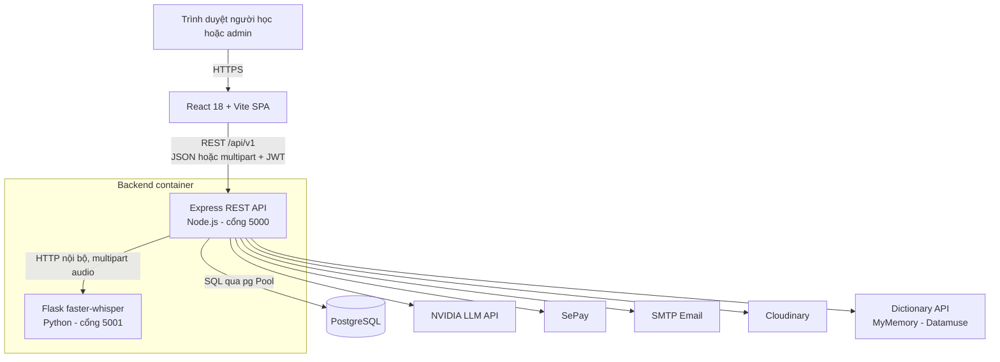
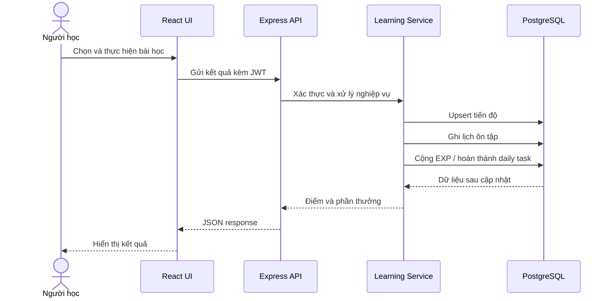

# LingoConnect - website tự học tiếng Anh

LingoConnect là hệ thống web hỗ trợ người học rèn luyện tiếng Anh trên một nền tảng thống nhất. Hệ thống cung cấp bài học theo bốn kỹ năng, ngữ pháp, từ điển, bộ sưu tập từ vựng, mini-game, nhiệm vụ hằng ngày, theo dõi tiến độ và cơ chế gamification. Ngoài ra, hệ thống tích hợp nhận diện giọng nói, mô hình ngôn ngữ lớn và thanh toán để cung cấp các chức năng nâng cao.

Tài liệu này tóm tắt dự án ở mức đủ để tiếp quản mã nguồn hoặc phát triển thành báo cáo đồ án chi tiết. Nội dung được đối chiếu với mã nguồn hiện tại, không chỉ dựa trên ý tưởng ban đầu của đề tài.

## 1. Thông tin đề tài

- Tên đề tài: **Xây dựng website tự học tiếng Anh**.
- Tên sản phẩm: **LingoConnect**.
- Kiểu hệ thống: ứng dụng web SPA theo mô hình client-server.
- Đối tượng sử dụng: khách, người học, người học Plus và quản trị viên.
- Mục tiêu chính: tổ chức nội dung học theo kỹ năng, cá nhân hóa điểm bắt đầu, duy trì thói quen học, lưu tiến độ và hỗ trợ quản trị nội dung tập trung.

### Bài toán cần giải quyết

Người tự học thường phải dùng nhiều công cụ riêng cho bài học, từ điển, luyện phát âm và theo dõi tiến độ. LingoConnect gom các hoạt động này vào một quy trình liên tục:

1. Đăng ký và xác định trình độ ban đầu.
2. Nhận lộ trình, bài học và nhiệm vụ phù hợp.
3. Thực hành, nhận điểm và phản hồi.
4. Lưu tiến độ, EXP, level, streak và lịch ôn tập.
5. Quay lại ôn theo nhiệm vụ hằng ngày và spaced repetition.

## 2. Phạm vi và tác nhân

| Tác nhân | Quyền và chức năng chính |
| --- | --- |
| Khách (Guest) | Xem trang giới thiệu, đăng ký, đăng nhập, yêu cầu đặt lại mật khẩu. |
| Người học (Learner) | Làm onboarding/placement, học bài, tra từ, quản lý từ vựng, chơi game, làm nhiệm vụ ngày, theo dõi tiến độ, quản lý hồ sơ và gửi yêu cầu hỗ trợ. |
| Người học Plus | Có toàn bộ quyền của Learner và được dùng các chức năng có `PlusRoute`/`requirePlus`, gồm Speaking, Speaking AI và Listening theo mã nguồn hiện tại. |
| Quản trị viên (Admin) | Xem dashboard quản trị; quản lý người dùng, nội dung kỹ năng, ngữ pháp, từ vựng, game, câu hỏi placement, thông báo và ticket hỗ trợ. Tài khoản admin không dùng khu vực học viên. |
| Dịch vụ ngoài | Whisper nhận dạng tiếng nói; NVIDIA LLM sinh/chấm nội dung; SePay đối soát thanh toán; SMTP gửi email; Cloudinary lưu ảnh/tệp đính kèm; các API từ điển công cộng. |

## 3. Chức năng nghiệp vụ

### 3.1. Tài khoản và phân quyền

- Đăng ký bằng username, email và mật khẩu.
- Băm mật khẩu bằng bcrypt trước khi lưu.
- Đăng nhập và xác thực API bằng JWT Bearer token.
- Quên mật khẩu qua mã xác minh email có thời hạn 10 phút.
- Cập nhật hồ sơ, avatar, mật khẩu và đặt lại tiến độ học.
- Phân quyền theo hai role đang hoạt động: `user` và `admin`.
- Kiểm tra lại trạng thái tài khoản trong cơ sở dữ liệu ở mỗi request được bảo vệ; tài khoản bị khóa không thể tiếp tục dùng token cũ.

### 3.2. Onboarding và kiểm tra đầu vào

- Người học chọn mục tiêu/thông tin ban đầu qua khảo sát.
- Trường hợp tự nhận là mới bắt đầu hoặc cơ bản có thể được xếp trực tiếp.
- Trường hợp làm bài placement sẽ nhận bộ câu hỏi từ nhiều kỹ năng.
- Attempt được ký/mã hóa, ràng buộc theo user và hết hạn sau 2 giờ.
- Câu trả lời được chấm theo loại câu hỏi; Speaking và Writing dùng ngưỡng riêng.
- Điểm tổng có trọng số; mốc đạt hiện tại là 70%. Kết quả cập nhật `PlacementLevel`, nguồn xếp lớp và trạng thái hoàn thành onboarding.
- Danh sách bài học hiển thị dựa trên level và cờ bài nền tảng (`IsFoundation`).

### 3.3. Các module học tập

| Module | Nội dung chính | Kết quả được lưu |
| --- | --- | --- |
| Listening | Danh sách bài, audio, speaker, segment, câu hỏi và từ vựng. | Điểm, trạng thái hoàn thành, tiến độ. |
| Reading | Bài đọc theo paragraph, câu hỏi và từ vựng. | Điểm, trạng thái hoàn thành, tiến độ. |
| Speaking | Câu mẫu, ghi âm, transcript, so khớp câu nói và phản hồi. | Điểm và tiến độ bài học. |
| Writing | Bài học, bài tập, từ vựng gợi ý, chấm câu trả lời và phản hồi. | Điểm và tiến độ bài học. |
| Grammar | Danh mục, chủ điểm, phần lý thuyết và quiz. | Điểm tốt nhất, số lần làm và trạng thái hoàn thành. |

Các bài học hoàn thành có thể đồng thời cập nhật spaced repetition, cộng EXP và tự hoàn thành nhiệm vụ ngày tương ứng.

### 3.4. Speaking và AI

Luồng luyện nói chuẩn:

1. Trình duyệt ghi âm bằng MediaRecorder.
2. Frontend gửi tệp audio dạng multipart tới Express API.
3. Express chuyển audio tới Flask Whisper service.
4. `faster-whisper` tạo transcript tiếng Anh.
5. Thuật toán chuẩn hóa câu và căn chỉnh từ theo thứ tự so transcript với câu đích.
6. Hệ thống trả điểm, câu khớp nhất, từ thiếu, từ thừa và phản hồi.

Thuật toán so khớp xử lý contraction, số, tiền tệ, từ đệm và biến thể từ đơn giản. Điểm kết hợp recall, precision/F1 và tỷ lệ độ dài; việc căn chỉnh dùng quy hoạch động và độ tương đồng Levenshtein.

Speaking AI cho phép người dùng Plus chọn chủ đề và độ khó để bắt đầu một hội thoại liên tục kiểu Messenger. AI nói trước và đưa ra ba câu trả lời; người học chọn một câu, ghi âm và phải đạt ngưỡng phát âm trước khi hội thoại đi tiếp. Lượt AI tiếp theo được sinh từ toàn bộ lịch sử nên giữ nguyên vai, bối cảnh và các lựa chọn trước đó. AI được phép kết thúc tự nhiên từ lượt 4 và hệ thống bắt buộc khép lại ở lượt 12.

Nội dung hội thoại được lưu trong `localStorage` của trình duyệt trong 24 giờ, không lưu vào PostgreSQL và không thưởng EXP. Backend không giữ session trong memory; state token JWT, option hash và history hash bảo vệ trạng thái từng lượt. Vì vậy phiên có thể tiếp tục sau khi backend restart, miễn là dùng đúng trình duyệt và token chưa hết hạn.

### 3.5. Writing với phản hồi AI

- Hệ thống chuẩn hóa câu trả lời và tính độ tương đồng trước.
- Trường hợp quá rõ ràng có thể trả kết quả nhanh bằng luật cục bộ.
- Trường hợp cần đánh giá linh hoạt, backend gọi NVIDIA LLM để lấy điểm, câu sửa và phản hồi.
- Có timeout, cache và fallback nhằm giảm phụ thuộc hoàn toàn vào dịch vụ AI.

### 3.6. Từ điển và bộ sưu tập từ vựng

- Tra Anh-Việt hoặc Việt-Anh.
- Lấy định nghĩa/phát âm từ Dictionary API, dịch bằng MyMemory và gợi ý/autocomplete bằng Datamuse.
- Module từ điển hiện hoạt động theo API ngoài, không lưu lịch sử tra cứu vào cơ sở dữ liệu.
- Người học có thể tạo bộ sưu tập riêng, thêm/sửa/xóa từ và luyện ôn tập.
- Bộ sưu tập có quy trình gửi công khai và chờ admin duyệt.

### 3.7. Mini-game, gamification và nhiệm vụ ngày

- Mini-game được tổ chức theo level, độ khó, thời gian và điểm đạt.
- Kết quả game gồm điểm, số sao, EXP và tiến độ level.
- `UserStats` lưu EXP, level, streak và lần đăng nhập gần nhất.
- Level được tính lại từ các ngưỡng EXP tập trung trong `backend/src/utils/constants.js`.
- Mỗi ngày hệ thống tạo task đăng nhập và các task học có tính đa dạng kỹ năng.
- Task ưu tiên nội dung đến hạn ôn, sau đó mới chọn nội dung mới tuần tự theo placement và quyền Plus.
- Hoàn thành task được cộng EXP đúng một lần.

Spaced repetition được triển khai gần với SM-2:

- Điểm 0-100 được quy đổi thành quality 0-5.
- Nếu quality dưới 3, số lần lặp về 0 và hẹn lại sau 1 ngày.
- Các lần đạt đầu tiên có khoảng cách 1 ngày, 6 ngày, sau đó nhân theo `easeFactor`.
- `easeFactor` không thấp hơn 1.3; hệ thống lưu cả review item và lịch sử review.

### 3.8. Gói Plus và thanh toán

- Người học tạo yêu cầu nâng cấp Plus.
- Backend tạo `PaymentRequests`, nội dung chuyển khoản duy nhất và URL QR.
- Frontend kiểm tra trạng thái order định kỳ.
- Backend nhận webhook hoặc chủ động đối soát danh sách giao dịch SePay.
- Khi số tiền và nội dung khớp, order chuyển sang `completed`, tài khoản thành `plus` và được gia hạn `PlusExpiresAt`.
- Giá và thời hạn lấy từ biến môi trường; mặc định trong mã hiện tại là 2.000 VND/30 ngày, chỉ phù hợp demo và phải cấu hình lại khi triển khai thật.

### 3.9. Quản trị và hỗ trợ

Admin có thể:

- Xem thống kê tổng quan và hoạt động học.
- CRUD bài học/câu hỏi của Speaking, Writing, Listening, Reading và Grammar.
- Quản lý speaker, segment, paragraph và từ vựng theo bài.
- CRUD level/câu hỏi mini-game và câu hỏi placement.
- Quản lý bộ sưu tập từ vựng công khai.
- Tạo, sửa, khóa/mở, đổi mật khẩu, cộng ngày Plus hoặc xóa tài khoản.
- Tạo thông báo cho người dùng.
- Tiếp nhận, phản hồi và thay đổi trạng thái ticket hỗ trợ.

## 4. Kiến trúc hệ thống



### Cách tổ chức backend

Backend chủ yếu dùng luồng:

```text
Route -> Middleware -> Controller -> Service/Repository -> PostgreSQL hoặc dịch vụ ngoài
```

- Route định nghĩa endpoint và middleware.
- Middleware xử lý JWT, role, Plus, validate, upload và lỗi.
- Controller tiếp nhận request, gọi nghiệp vụ và chuẩn hóa response.
- Service xử lý nghiệp vụ/truy vấn; repository được dùng ở module collection.
- `database.js` dùng PostgreSQL `pg` và cung cấp adapter truy vấn tham số có tên qua cú pháp `request().input().query()`.

### Luồng dữ liệu học tập tổng quát



## 5. Công nghệ sử dụng

| Nhóm | Công nghệ | Vai trò |
| --- | --- | --- |
| Frontend | React 18, React Router 6, Vite 5 | SPA, component UI, routing và build. |
| Giao tiếp/UI | Axios, Framer Motion, React Hot Toast, React Icons | Gọi API, animation, thông báo và icon. |
| Soạn thảo/an toàn HTML | React Quill, DOMPurify | Nhập nội dung giàu định dạng và làm sạch HTML. |
| Backend | Node.js, Express 4 | REST API và nghiệp vụ chính. |
| Cơ sở dữ liệu | PostgreSQL, package `pg` | Lưu user, nội dung, tiến độ và giao dịch. |
| Xác thực/bảo mật | JWT, bcryptjs, Helmet, CORS, express-validator | Authentication, password hashing, header bảo mật và validation. |
| Tệp/media | Multer, FormData, Cloudinary | Nhận upload và lưu media ngoài. |
| AI giọng nói | Flask, faster-whisper, CTranslate2, FFmpeg | Chuyển giọng nói tiếng Anh thành văn bản. |
| AI tạo sinh | NVIDIA Chat Completions API | Sinh Speaking AI và hỗ trợ chấm Writing. |
| Thanh toán/email | SePay, Nodemailer/SMTP | Đối soát nâng cấp Plus và gửi mã reset. |
| Triển khai | Docker, Railway/Railpack, Vercel | Đóng gói backend và triển khai frontend. |

## 6. Cấu trúc mã nguồn

```text
tiengAnh/
|-- frontend/                    # React SPA
|   |-- public/                  # favicon, icon, ảnh landing page
|   |-- src/
|   |   |-- api/                 # axios client và API theo module
|   |   |-- components/          # component common, layout và bài học
|   |   |-- contexts/            # AuthContext
|   |   |-- hooks/               # auth, debounce, study-time tracker
|   |   |-- pages/               # trang public và learner
|   |   |-- pages/admin/         # trang quản trị
|   |   |-- styles/              # CSS dùng chung
|   |   `-- App.jsx              # toàn bộ route frontend
|   `-- vercel.json              # cấu hình frontend production
|-- backend/
|   |-- src/
|   |   |-- config/              # PostgreSQL, JWT, CORS
|   |   |-- middlewares/         # auth, role, Plus, upload, validate, lỗi
|   |   |-- modules/             # các module nghiệp vụ
|   |   |-- repositories/        # lớp truy cập dữ liệu dùng lại
|   |   `-- app.js               # middleware và mount API /api/v1
|   |-- scripts/                 # migrate, seed, audit, cleanup
|   |-- test/                    # test thuật toán daily/SRS
|   |-- server.js                # entry point Express
|   |-- whisper_server.py        # microservice nhận diện giọng nói
|   `-- Dockerfile               # Node + Python + FFmpeg
|-- baocao/                      # tài liệu, bản báo cáo và hình minh họa
|-- scripts/                     # script tạo hình cho báo cáo
`-- cosodulieu.sql               # PostgreSQL dump gồm schema và dữ liệu mẫu
```

## 7. API chính

Base URL mặc định: `http://localhost:5000/api/v1`.

| Nhóm route | Prefix | Nghiệp vụ tiêu biểu |
| --- | --- | --- |
| Health | `/health` | Kiểm tra Express API. |
| Auth | `/auth` | Register, login, forgot/reset password, current user. |
| User | `/users` | Hồ sơ, avatar, mật khẩu, reset tiến độ, stats. |
| Onboarding | `/onboarding` | Status, survey, tạo/check/submit placement attempt. |
| Dashboard | `/dashboard` | Tổng quan học tập. |
| Listening/Reading | `/listening`, `/reading` | Danh sách, chi tiết và lưu progress. |
| Speaking | `/speaking` | Bài học cố định; tạo hội thoại AI; chấm lượt nói và sinh phản hồi kế tiếp. |
| Writing | `/writing` | Bài học, chấm Writing và progress. |
| Grammar | `/grammar` | Category, topic, quiz attempt. |
| Dictionary | `/dictionary` | Search, autocomplete, translate. |
| Vocabulary | `/collections` | CRUD collection/word và public review. |
| Game | `/games` | Level, câu hỏi và submit kết quả. |
| Gamification | `/gamification` | Stats và EXP. |
| Daily task | `/daily-tasks` | Kế hoạch hôm nay và hoàn thành task. |
| Study time | `/study-time` | Heartbeat thời gian học chủ động. |
| Billing | `/billing` | Subscription, Plus order, status và SePay webhook. |
| Support | `/support` | Ticket và tin nhắn của learner. |
| Notification | `/notifications` | Danh sách và đánh dấu đã đọc. |
| Admin | `/admin` | Dashboard, CRUD nội dung, user, support. |

Các endpoint learner/admin đều dùng JWT, trừ các endpoint auth công khai, health check và SePay webhook. Phân quyền cụ thể được đặt trong route/middleware của từng module.

Luồng API riêng của Speaking AI:

- `POST /api/v1/speaking/personalized`: tạo lời mở đầu từ `topic` và `level`.
- `POST /api/v1/speaking/personalized/:sessionId/analyze-turn`: upload audio, chấm câu đã chọn và phát hành advance token khi đạt ngưỡng.
- `POST /api/v1/speaking/personalized/:sessionId/next-turn`: xác thực lịch sử rồi sinh phản hồi AI tiếp theo hoặc lời kết.

## 8. Thiết kế cơ sở dữ liệu

`cosodulieu.sql` là PostgreSQL dump chứa schema và dữ liệu mẫu. Ngoài các bảng trong dump, một số service tự tạo/bổ sung schema bằng `CREATE TABLE IF NOT EXISTS` hoặc `ALTER TABLE ... IF NOT EXISTS` khi chức năng chạy.

### Các cụm dữ liệu chính

| Cụm | Bảng quan trọng |
| --- | --- |
| User và trình độ | `Users`, `LearningLevels`, `UserStats` |
| Listening | `ListeningLessons`, `ListeningSpeakers`, `ListeningSegments`, `ListeningQuestions`, `ListeningVocabulary`, `ListeningProgress` |
| Reading | `ReadingLessons`, `ReadingParagraphs`, `ReadingQuestions`, `ReadingVocabulary`, `ReadingProgress` |
| Speaking | `SpeakingLessons`, `SpeakingQuestions`, `SpeakingProgress` |
| Writing | `WritingLessons`, `WritingExercises`, `WritingVocab`, `WritingProgress` |
| Grammar | `GrammarCategories`, `GrammarTopics`, `GrammarQuiz`, `GrammarProgress` |
| Từ vựng | `UserCollections`, `UserCollectionWords` |
| Game và placement | `GameLevels`, `MiniGameQuestions`, `PlacementMiniGameQuestions`, `UserGameProgress` |
| Daily và ôn tập | `DailyTasks`, `SpacedRepetitionItems`, `SpacedRepetitionReviews`, `StudyTimeDaily` |
| Gamification/insight | `Achievements`, `UserAchievements`, `UserErrorEvents`, `UserWeaknesses` |
| Thanh toán | `PaymentRequests`; cột `Plan`, `PlusExpiresAt` trong `Users` |
| Hệ thống bổ trợ | `PasswordResetCodes`, `Notifications`, `NotificationRecipients`, `SupportTickets`, `SupportTicketMessages` |

### Quan hệ cốt lõi

- Một `User` có một `UserStats` và nhiều bản ghi progress, task, collection, review, payment, notification recipient và support ticket.
- Một lesson có nhiều phần nội dung/câu hỏi/từ vựng; progress nối user với lesson.
- `GrammarCategory -> GrammarTopic -> GrammarQuiz`.
- `UserCollection -> UserCollectionWord`.
- `GameLevel -> MiniGameQuestion`; `UserGameProgress` nối user với game level.
- `SpacedRepetitionItem -> SpacedRepetitionReview`; item tham chiếu logic tới nội dung qua `TargetType` và `TargetId`.
- `Notification -> NotificationRecipient` và `SupportTicket -> SupportTicketMessage`.

Khi vẽ ERD cho báo cáo, nên chia thành các cụm trên thay vì đặt toàn bộ bảng vào một hình duy nhất. Một ERD tổng quan thể hiện quan hệ giữa các cụm, sau đó dùng ERD chi tiết cho user/progress và từng nhóm bài học.

## 9. Cài đặt và chạy cục bộ

### Yêu cầu môi trường

- Node.js 22 (Dockerfile và Railpack đang cấu hình Node 22).
- npm.
- PostgreSQL; dump hiện được tạo từ PostgreSQL 18.3.
- Python 3.11 và FFmpeg nếu chạy Whisper.
- Tối thiểu khoảng vài GB dung lượng trống cho Python package và Whisper model.

### 9.1. Khôi phục cơ sở dữ liệu

Tạo database, sau đó chạy dump bằng `psql`:

```powershell
createdb -U postgres EnglishLearningSystem
psql -U postgres -d EnglishLearningSystem -f .\cosodulieu.sql
```

### 9.2. Cấu hình backend

Tạo `backend/.env`. Cấu hình tối thiểu để chạy API:

```dotenv
NODE_ENV=development
PORT=5000
CLIENT_URL=http://localhost:5173

DB_HOST=localhost
DB_PORT=5432
DB_NAME=EnglishLearningSystem
DB_USER=postgres
DB_PASSWORD=your_password
DB_SSL=false

JWT_SECRET=replace_with_a_long_random_secret
JWT_EXPIRES_IN=7d
```

Có thể thay nhóm `DB_*` bằng một `DATABASE_URL`. Các tích hợp sau là tùy chức năng:

```dotenv
# Whisper
WHISPER_SERVER_URL=http://127.0.0.1:5001
WHISPER_MODEL=small
WHISPER_DEVICE=cpu
WHISPER_COMPUTE=int8
WHISPER_PORT=5001

# NVIDIA LLM
NVIDIA_API_KEY=
NVIDIA_BASE_URL=https://integrate.api.nvidia.com/v1
SPEAKING_NVIDIA_MODEL=meta/llama-3.1-8b-instruct
WRITING_NVIDIA_MODEL=meta/llama-3.1-8b-instruct

# SMTP
SMTP_HOST=
SMTP_PORT=587
SMTP_USER=
SMTP_PASS=
SMTP_SECURE=false
MAIL_FROM=

# Cloudinary
CLOUDINARY_CLOUD_NAME=
CLOUDINARY_API_KEY=
CLOUDINARY_API_SECRET=

# SePay / Plus
PLUS_PRICE_VND=2000
PLUS_DURATION_DAYS=30
SEPAY_BANK_CODE=
SEPAY_ACCOUNT_NUMBER=
SEPAY_ACCOUNT_NAME=
SEPAY_WEBHOOK_API_KEY=
SEPAY_API_TOKEN=

APP_NAME=LingoConnect
FRONTEND_URL=http://localhost:5173
```

Không commit `.env` hoặc khóa API vào repository.

### 9.3. Chạy backend và Whisper

```powershell
cd backend
npm install
pip install -r requirements.txt
npm run dev:all
```

Hoặc chạy riêng để dễ theo dõi log:

```powershell
# Terminal 1
cd backend
npm run dev

# Terminal 2
cd backend
python whisper_server.py
```

Kiểm tra dịch vụ:

- Express: `http://localhost:5000/api/v1/health`
- Whisper: `http://localhost:5001/health`

### 9.4. Chạy frontend

```powershell
cd frontend
npm install
npm run dev
```

Mở `http://localhost:5173`. Frontend mặc định gọi `http://localhost:5000/api/v1`; có thể thay bằng `frontend/.env`:

```dotenv
VITE_API_URL=http://localhost:5000/api/v1
```

## 10. Kiểm thử và kiểm tra chất lượng

Các lệnh hiện có:

```powershell
# Chạy toàn bộ backend test
cd backend
npm test

# Chỉ test hội thoại Speaking AI
npm run test:speaking-conversation

# Kiểm tra frontend có build được
cd frontend
npm run build

# Kiểm tra kết nối và số lượng bản ghi database
cd backend
npm run db:counts
```

Nhóm test case nên đưa vào báo cáo:

| Nhóm | Tình huống cần kiểm thử |
| --- | --- |
| Auth | Đăng ký hợp lệ/trùng email, đăng nhập đúng/sai, user bị khóa, token hết hạn, reset code sai/hết hạn. |
| Placement | Xếp trực tiếp, tạo attempt, answer đúng/sai theo loại, attempt sai user/hết hạn, cập nhật level. |
| Learning | Mở khóa bài theo placement, nộp kết quả, upsert progress, cộng EXP, hoàn thành task. |
| Speaking | Audio hợp lệ/không hỗ trợ, Whisper lỗi, transcript đúng/sai, token/history bị sửa, câu không thuộc lựa chọn, retry AI, giới hạn Plus và tự kết thúc lượt 4-12. |
| Writing | Câu gần đúng, sai rõ ràng, LLM timeout/mất API key, fallback. |
| Daily/SRS | Ưu tiên bài đến hạn, đa dạng kỹ năng, quality dưới 3, lịch 1-6-n ngày, không cộng thưởng hai lần. |
| Billing | Tạo order, giao dịch không khớp, webhook sai key, đối soát đúng, gia hạn user đã Plus. |
| Authorization | Learner gọi admin API, admin vào learner API, free user gọi Plus API. |
| Admin | CRUD từng loại nội dung, khóa/mở user, duyệt collection, xử lý ticket. |

## 11. Triển khai

- Frontend có thể build thành static assets và triển khai trên Vercel.
- Backend có Dockerfile cài Node 22, Python, FFmpeg và các dependency Whisper; command production chạy đồng thời Express và Whisper.
- PostgreSQL có thể đặt trên Railway hoặc một dịch vụ managed database.
- Biến `VITE_API_URL`, `CLIENT_URL`/`FRONTEND_URL`, database URL và khóa dịch vụ phải trỏ đúng domain production.
- CORS hiện cho phép client được cấu hình, localhost và subdomain `*.vercel.app`.

Luồng triển khai tham chiếu:

```text
Browser -> Vercel (React SPA) -> Railway/Docker (Express + Whisper) -> PostgreSQL
                                      |-> NVIDIA / SePay / SMTP / Cloudinary
```

## 12. Bảo mật đã áp dụng

- Băm mật khẩu với bcrypt và không trả password hash ra API.
- JWT Bearer token cho route bảo vệ.
- Role-based access control và kiểm tra riêng learner/admin.
- Middleware Plus ở cả frontend lẫn backend.
- Helmet, CORS, giới hạn kích thước JSON và upload.
- Validate request ở các luồng auth.
- Tham số hóa truy vấn SQL; adapter chuyển tham số có tên `@param` thành placeholder PostgreSQL.
- Kiểm tra trạng thái user ở mỗi request authenticated.
- DOMPurify cho nội dung HTML phía frontend.
- Webhook SePay có API key và giao dịch được đối chiếu theo amount/content/account.

Các điểm cần tăng cường nếu đưa vào vận hành thật: rate limiting, refresh token/revocation, CSRF strategy nếu chuyển sang cookie, quét file upload, quản lý secret tập trung, audit log quản trị, transaction cho các cập nhật nhiều bảng và test bảo mật tự động.

## 13. Hạn chế hiện tại và hướng phát triển

1. Hội thoại Speaking AI chỉ lưu trên trình duyệt: không đồng bộ giữa thiết bị và không thể mở từ một browser khác. Nếu cần đồng bộ tài khoản, nên chuyển snapshot sang PostgreSQL hoặc Redis.
2. Schema được hình thành từ dump, script migration và lệnh `ensureSchema` lúc chạy. Nên chuẩn hóa thành một migration chain có version.
3. Từ điển phụ thuộc API công cộng và hiện không lưu history; chất lượng/độ sẵn sàng phụ thuộc nhà cung cấp.
4. Whisper model chạy CPU tốn tài nguyên và lần tải model đầu tiên lâu; production nên tách service, warm-up và cân nhắc GPU.
5. Chấm Speaking chủ yếu đánh giá mức khớp từ với câu mẫu, chưa đánh giá đầy đủ âm vị, trọng âm và ngữ điệu.
6. Kết quả từ LLM có tính xác suất; cần tiếp tục validate, lưu phiên bản prompt/model và cho phép giáo viên kiểm duyệt.
7. Test tự động đã bao phủ thuật toán daily/SRS và state token Speaking AI; vẫn cần bổ sung integration, API và end-to-end test.
8. Giá Plus mặc định chỉ là giá demo. Thanh toán production cần quy trình hoàn tiền, đối soát, idempotency và logging chặt hơn.

## 14. Gợi ý chuyển thành báo cáo đồ án

### Chương 1 - Tổng quan đề tài

- Lý do chọn đề tài và vấn đề của người tự học.
- Mục tiêu, đối tượng, phạm vi và kết quả mong đợi.
- Giới thiệu ngắn giải pháp LingoConnect.

### Chương 2 - Cơ sở lý thuyết và công nghệ

- SPA, client-server, REST API và JWT.
- React, Node.js/Express và PostgreSQL.
- Nhận dạng tiếng nói với Whisper.
- Levenshtein, quy hoạch động, precision/recall/F1.
- LLM trong sinh/chấm nội dung giáo dục.
- Gamification và spaced repetition kiểu SM-2.

### Chương 3 - Phân tích yêu cầu

- Tác nhân và yêu cầu chức năng/phi chức năng.
- Một use case tổng quát và đặc tả các use case quan trọng.
- Quy tắc phân quyền, placement, mở khóa bài và Plus.

### Chương 4 - Phân tích và thiết kế

- Kiến trúc tổng thể và package diagram frontend/backend.
- Thiết kế ERD theo cụm dữ liệu.
- Sequence diagram cho đăng nhập, placement, hoàn thành bài, Speaking, Writing, thanh toán và admin CRUD.
- Thiết kế API, middleware và bảo mật.

### Chương 5 - Cài đặt và triển khai

- Cấu trúc mã nguồn và cách hiện thực từng module.
- Hình giao diện người học và admin.
- Tích hợp Whisper, NVIDIA, SePay, SMTP, Cloudinary.
- Môi trường local, Docker và sơ đồ triển khai.

### Chương 6 - Kiểm thử và đánh giá

- Môi trường, dữ liệu và bảng test case.
- Kết quả test chức năng, phân quyền, lỗi tích hợp ngoài và hiệu năng cơ bản.
- Kết quả đạt được, hạn chế và hướng phát triển từ mục 13.

### Sơ đồ nên có

- Use case tổng quát cho Guest, Learner, Plus Learner và Admin.
- Sơ đồ kiến trúc 4 tầng và deployment diagram.
- ERD tổng quan, ERD user/progress và ERD các nhóm bài học.
- Package diagram frontend/backend.
- Sequence diagram: login, placement, hoàn thành bài, Speaking + Whisper, Speaking AI, Writing AI, thanh toán SePay và admin CRUD.

### Ảnh giao diện nên chụp

Landing page, đăng ký/đăng nhập, onboarding/placement, dashboard, course hub, từng loại bài học, Speaking AI, dictionary, vocabulary collection, grammar, games, daily tasks, settings/Plus, support và các trang quản trị chính.

## 15. Tệp tham chiếu quan trọng

- `frontend/src/App.jsx`: toàn bộ route và ranh giới public/learner/admin/Plus.
- `backend/src/app.js`: danh sách module API.
- `backend/src/modules/onboarding/onboarding.service.js`: placement.
- `backend/src/modules/spaced-repetition/spaced-repetition.service.js`: thuật toán lịch ôn.
- `backend/src/modules/daily/daily.service.js`: chọn nhiệm vụ hằng ngày.
- `backend/src/modules/speaking/`: Whisper, chấm nói và Speaking AI.
- `backend/src/modules/writing/writing.controller.js`: chấm Writing và fallback AI.
- `backend/src/modules/billing/billing.service.js`: Plus và SePay.
- `backend/src/modules/admin/admin.routes.js`: phạm vi quản trị.
- `cosodulieu.sql`: schema/dữ liệu PostgreSQL tại thời điểm dump.
- `baocao/`: báo cáo Word, tài liệu rà soát và hình sơ đồ.

---

README phản ánh trạng thái mã nguồn tại ngày 29/06/2026. Khi viết báo cáo chính thức, cần đối chiếu lại các con số thống kê, ảnh giao diện, kết quả test và cấu hình triển khai thực tế thay vì suy diễn từ dữ liệu mẫu.
