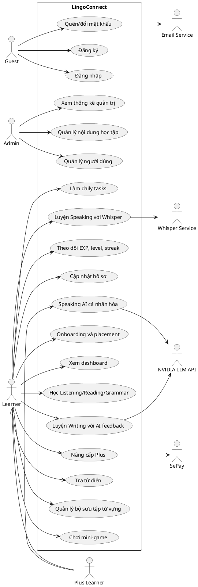

# README hỗ trợ hoàn thiện báo cáo - Website tự học tiếng Anh

Tài liệu này tóm tắt thông tin cần thiết để hoàn thiện báo cáo cho project `tiengAnh`: mô tả hệ thống, công nghệ, phân hệ, CSDL, **một Use Case tổng quát**, ERD, package diagram và các sơ đồ tuần tự cần vẽ.

## 1. Tổng quan hệ thống

- Tên đề tài: Xây dựng website tự học tiếng Anh.
- Tên hệ thống gợi ý: LingoConnect.
- Mục tiêu: xây dựng nền tảng web giúp người học luyện Listening, Reading, Speaking, Writing, Grammar, Vocabulary, Dictionary, Mini-game, Daily Tasks, Gamification, Placement/Onboarding, thanh toán Plus và quản trị nội dung.
- Actor chính:
  - Guest: xem trang chủ, đăng ký, đăng nhập, quên mật khẩu.
  - Learner: học bài, luyện tập, theo dõi tiến độ, tra từ điển, quản lý bộ sưu tập từ vựng, chơi game, làm daily tasks, nâng cấp Plus.
  - Plus Learner: kế thừa Learner, dùng AI Speaking cá nhân hóa.
  - Admin: quản lý người dùng, bài học, câu hỏi, từ vựng, ngữ pháp, game, placement questions và xem thống kê.
  - External Services: Whisper Service, NVIDIA LLM API, SePay, Email/Nodemailer.

## 2. Công nghệ sử dụng

### Frontend

- React 18, Vite.
- React Router DOM v6: định tuyến SPA.
- Axios: gọi REST API.
- Framer Motion: animation.
- React Hot Toast: thông báo.
- React Icons: icon.
- React Quill: editor nội dung.
- DOMPurify: làm sạch HTML nội dung.
- CSS chính: `App.css`, `admin.css`, `learningSession.css`, `homeLanding.css`.

### Backend

- Node.js, Express.js.
- PostgreSQL với package `pg`.
- JWT bằng `jsonwebtoken`.
- Băm mật khẩu bằng `bcryptjs`.
- Middleware/bảo mật: `helmet`, `cors`, `morgan`, `express-validator`, `multer`.
- Email: `nodemailer`.
- Gọi dịch vụ ngoài: `axios`, `form-data`.

### AI và dịch vụ ngoài

- `backend/whisper_server.py`: Flask service dùng `faster-whisper` để nhận diện giọng nói.
- NVIDIA LLM API: sinh bài Speaking cá nhân hóa và chấm Writing.
- SePay: tạo QR/thông tin chuyển khoản, đối soát giao dịch Plus.
- MediaRecorder API: ghi âm Speaking trên trình duyệt.
- Web Speech API: phát âm/TTS trên trình duyệt.

## 3. Kiến trúc tổng thể

Mô hình nên mô tả theo 4 tầng:

1. Client layer: React SPA chạy trên trình duyệt.
2. API layer: Express REST API, JWT middleware, role middleware, upload middleware.
3. Data layer: PostgreSQL.
4. External/AI layer: Flask Whisper, NVIDIA LLM, SePay, Email service.

PlantUML kiến trúc:

```plantuml
@startuml
skinparam componentStyle rectangle
actor "Người học" as Learner
actor "Quản trị viên" as Admin
node "Browser" { component "React SPA\n(Vite)" as FE }
node "Backend Server" {
  component "Express API\n/api/v1" as API
  component "Auth Middleware\nJWT + Role" as Auth
  component "Learning Modules" as Modules
}
database "PostgreSQL" as DB
node "AI Services" {
  component "Flask Whisper\nfaster-whisper" as Whisper
  component "NVIDIA LLM API" as LLM
}
cloud "External Services" {
  component "SePay" as SePay
  component "Email SMTP/Nodemailer" as Mail
}
Learner --> FE
Admin --> FE
FE --> API : REST + JWT
API --> Auth
API --> Modules
Modules --> DB
Modules --> Whisper : audio multipart
Modules --> LLM : chat/completions
Modules --> SePay : QR/reconcile
Modules --> Mail : OTP/reset password
@enduml
```

## 4. Cấu trúc thư mục

### Frontend

- `frontend/src/App.jsx`: định nghĩa route public, learner routes và admin routes.
- `frontend/src/api`: các file gọi API theo module.
- `frontend/src/contexts/AuthContext.jsx`: quản lý trạng thái đăng nhập.
- `frontend/src/hooks`: hook dùng chung như `useAuth`, `useDebounce`, `useStudyTimeTracker`.
- `frontend/src/pages`: Home, Login, Register, Dashboard, CoursesHub, Grammar, Dictionary, Games, Profile, Onboarding.
- `frontend/src/components`: component bài học, layout, common controls.
- `frontend/src/pages/admin`: các trang quản trị nội dung.

### Backend

- `backend/server.js`: khởi động server và kết nối CSDL.
- `backend/src/app.js`: khai báo Express app, middleware, route `/api/v1`.
- `backend/src/config`: database, JWT, CORS.
- `backend/src/middlewares`: auth, role, upload, validator, error handler.
- `backend/src/modules`: các module nghiệp vụ.
- `backend/scripts`: migrate, seed, audit, import data.
- `backend/whisper_server.py`: service nhận diện giọng nói.

## 5. Endpoint chính

### Public/Auth

- `POST /api/v1/auth/register`: đăng ký.
- `POST /api/v1/auth/login`: đăng nhập, trả JWT.
- `POST /api/v1/auth/forgot-password`: gửi mã reset mật khẩu.
- `POST /api/v1/auth/reset-password`: đặt lại mật khẩu.
- `GET /api/v1/auth/me`: lấy thông tin user hiện tại.

### Learner

- Dashboard: `GET /api/v1/dashboard/overview`.
- Onboarding: `GET /api/v1/onboarding/status`, `POST /survey`, `POST /test-attempts`, `POST /test-attempts/check`, `POST /test-attempts/submit`.
- Speaking: `GET /lessons`, `GET /lessons/:id`, `POST /transcribe`, `POST /transcribe-analyze`, `POST /analyze`, `POST /progress`, `POST /personalized`, `GET /personalized/:sessionId`, `POST /personalized/:sessionId/complete`.
- Writing: `GET /lessons`, `GET /lessons/:id`, `POST /check`, `POST /progress`.
- Listening/Reading: `GET /lessons`, `GET /lessons/:id`, `POST /progress`.
- Grammar: `GET /categories`, `GET /categories/:categoryId/topics`, `GET /topics/:topicId`, `POST /attempt`.
- Dictionary: `GET /search`, `GET /autocomplete`, `POST /translate`, `GET /history/me`.
- Collections/Vocabulary: CRUD collection và word.
- Games: `GET /levels`, `GET /levels/:levelId/questions`, `POST /submit`.
- Daily tasks: `GET /today`, `POST /:id/complete`.
- Study time: `POST /heartbeat`.
- Billing: `GET /subscription`, `POST /plus/orders`, `GET /plus/orders/:id`.

### Admin

- `GET /api/v1/admin/dashboard/stats`.
- CRUD Speaking lessons/questions.
- CRUD Writing lessons/exercises/vocab.
- CRUD Listening lessons/speakers/segments/questions/vocab.
- CRUD Reading lessons/paragraphs/questions/vocab.
- CRUD Grammar categories/topics/quizzes.
- CRUD Vocabulary collections/words và review collection.
- CRUD Game levels/questions và Placement mini-game questions.
- Quản lý Users: tạo user, danh sách user, thống kê user, khóa/mở tài khoản.

## 6. Use Case tổng quát duy nhất

Báo cáo chỉ cần **một sơ đồ Use Case tổng quát**. Không cần tách riêng Use Case người học và Use Case quản trị viên.

### Use Case nên có trong sơ đồ

- Đăng ký, đăng nhập, quên/đổi mật khẩu.
- Làm onboarding và placement.
- Xem dashboard học tập.
- Học Listening, Reading, Grammar.
- Luyện Speaking với Whisper.
- Sinh bài Speaking AI cá nhân hóa.
- Luyện Writing với AI feedback.
- Tra từ điển.
- Quản lý bộ sưu tập từ vựng.
- Chơi mini-game.
- Làm daily tasks.
- Theo dõi EXP, level, streak, achievements.
- Cập nhật hồ sơ/avatar.
- Nâng cấp Plus.
- Quản lý nội dung học tập.
- Quản lý người dùng.
- Xem thống kê quản trị.

PlantUML Use Case tổng quát:



Quan hệ include/extend gợi ý:

- Các chức năng học include `Lưu tiến độ`.
- `Lưu tiến độ` include `Cộng EXP` và `Hoàn thành daily task phù hợp`.
- `Luyện Speaking với Whisper` include `Ghi âm`, `Gửi audio`, `Nhận transcript`, `Chấm điểm`.
- `Luyện Writing với AI feedback` include `Nhập câu trả lời`, `Tính similarity`, `Gọi LLM nếu cần`, `Trả feedback`.
- `Speaking AI cá nhân hóa` extend `Luyện Speaking`, điều kiện là tài khoản Plus.
- `Nâng cấp Plus` include `Tạo lệnh thanh toán`, `Quét QR`, `Kiểm tra trạng thái giao dịch`.

## 7. ERD và bảng dữ liệu

Nên vẽ ERD theo cụm:

- User/Auth/Level: `users`, `learninglevels`.
- Listening: `listeninglessons`, `listeningspeakers`, `listeningsegments`, `listeningquestions`, `listeningvocabulary`, `listeningprogress`.
- Reading: `readinglessons`, `readingparagraphs`, `readingquestions`, `readingvocabulary`, `readingprogress`.
- Speaking: `speakinglessons`, `speakingquestions`, `speakingprogress`.
- Writing: `writinglessons`, `writingexercises`, `writingvocab`, `writingprogress`.
- Grammar: `grammarcategories`, `grammartopics`, `grammarquiz`, `grammarprogress`.
- Vocabulary: `usercollections`, `usercollectionwords`.
- Game/Gamification/Daily: `gamelevels`, `minigamequestions`, `placementminigamequestions`, `usergameprogress`, `achievements`, `userachievements`, `userstats`, `dailytasks`, `usererrorevents`, `userweaknesses`, `studytimedaily`.
- Billing: `paymentrequests`, các cột `Plan`, `PlusExpiresAt` trong `users`.

Khóa ngoại quan trọng:

- `users.LevelId -> learninglevels.Id`.
- `listeningspeakers.LessonId -> listeninglessons.Id`.
- `listeningsegments.LessonId -> listeninglessons.Id`.
- `listeningsegments.SpeakerId -> listeningspeakers.Id`.
- `listeningquestions.LessonId -> listeninglessons.Id`.
- `readingparagraphs.LessonId -> readinglessons.Id`.
- `readingquestions.LessonId -> readinglessons.Id`.
- `speakingquestions.LessonId -> speakinglessons.Id`.
- `writingexercises.LessonId -> writinglessons.Id`.
- `writingvocab.ExerciseId -> writingexercises.Id`.
- `grammartopics.CategoryId -> grammarcategories.Id`.
- `grammarquiz.TopicId -> grammartopics.Id`.
- `usercollections.UserId -> users.Id`.
- `usercollectionwords.CollectionId -> usercollections.Id`.
- `minigamequestions.LevelId -> gamelevels.Id`.
- `paymentrequests.UserId -> users.Id`.

## 8. Sơ đồ phân lớp/package

Với project JavaScript, nên vẽ package/module diagram thay vì class diagram quá chi tiết.

- Frontend package: `api`, `contexts`, `hooks`, `components/layout`, `components/common`, `components/speaking`, `components/writing`, `components/listening`, `components/reading`, `pages`, `pages/admin`.
- Backend package: `config`, `middlewares`, `modules/auth`, `modules/user`, `modules/onboarding`, `modules/dashboard`, `modules/dictionary`, `modules/collection`, `modules/game`, `modules/gamification`, `modules/speaking`, `modules/writing`, `modules/listening`, `modules/reading`, `modules/grammar`, `modules/daily`, `modules/billing`, `modules/admin`.
- Liên kết ngoài: Speaking/Writing -> NVIDIA LLM, Speaking -> Flask Whisper, Billing -> SePay.

## 9. Các sơ đồ tuần tự cần vẽ

### 9.1. Đăng nhập và lấy thông tin user

Participant: User, React Login, Auth API, Auth Service, PostgreSQL.

Luồng: user nhập email/password -> frontend gọi `POST /auth/login` -> service lấy user theo email -> so sánh bcrypt -> tạo JWT -> frontend gọi `GET /auth/me` -> nhận thông tin user -> điều hướng dashboard hoặc admin.

### 9.2. Onboarding và placement

Participant: Learner, Onboarding Page, Onboarding API, PostgreSQL.

Luồng: mở onboarding -> lấy status -> gửi survey -> tạo placement attempt -> lặp từng câu hỏi check answer -> submit attempt -> tính điểm -> cập nhật placement level và onboardingCompleted.

### 9.3. Học Listening/Reading và lưu tiến độ

Participant: Learner, Lesson UI, Listening/Reading API, Gamification Service, Daily Service, PostgreSQL.

Luồng: lấy danh sách bài -> chọn bài -> lấy chi tiết bài, nội dung, câu hỏi, từ vựng -> làm bài -> gửi `POST /progress` -> upsert progress -> cộng EXP -> hoàn thành daily task phù hợp -> trả kết quả.

### 9.4. Speaking với Whisper

Participant: Learner, SpeakingLesson UI, Speaking API, Flask Whisper, Fuzzy Alignment.

Luồng: người học ghi âm -> frontend tạo audio WebM bằng MediaRecorder -> gửi `POST /speaking/transcribe-analyze` -> backend chuyển file sang Whisper -> Whisper transcribe -> normalize và alignment với targetTexts -> trả transcript, score, feedback, missingWords, extraWords.

### 9.5. Speaking AI cá nhân hóa cho Plus

Participant: Plus Learner, Speaking AI Builder, Speaking API, Billing Service, Speaking Service, NVIDIA LLM API.

Luồng: nhập topic/level/goal/questionCount -> API kiểm tra `isPlusUser` -> nếu không Plus trả 403 -> nếu Plus gọi LLM sinh JSON lesson -> validate dữ liệu -> tạo sessionId trong memory -> trả lesson và sentences.

### 9.6. Writing với similarity và LLM feedback

Participant: Learner, WritingLesson UI, Writing API, Writing Controller, NVIDIA LLM API.

Luồng: nhập câu trả lời -> gửi `POST /writing/check` -> normalize text -> tính similarity -> nếu quá đúng/quá sai thì dùng fallback -> nếu cần chấm linh hoạt thì gọi LLM -> normalize feedback -> trả score, passed, feedback, correctedText.

### 9.7. Nâng cấp Plus qua SePay

Participant: Learner, Billing UI, Billing API, Billing Service, PostgreSQL, SePay.

Luồng: tạo Plus order -> tìm order pending hoặc tạo mới `PaymentRequests` -> build QR URL -> người học chuyển khoản theo transferContent -> frontend poll order status -> service gọi SePay transactions để reconcile -> nếu match thì update `users.Plan='plus'`, `PlusExpiresAt`, update payment completed.

### 9.8. Admin CRUD nội dung

Participant: Admin, Admin Page, Admin API, Admin Content Service, PostgreSQL.

Luồng: admin mở trang quản lý -> API kiểm tra JWT và role admin -> lấy danh sách dữ liệu -> admin thêm/sửa/xóa -> service chạy INSERT/UPDATE/DELETE -> trả success -> frontend reload danh sách.

### 9.9. Mini-game

Participant: Learner, Game UI, Game API, Game Service, Gamification Service, PostgreSQL.

Luồng: lấy game levels -> chọn level -> lấy câu hỏi -> nộp answers -> service chấm điểm -> tính stars và expEarned -> upsert `usergameprogress` -> cập nhật `userstats`.

### 9.10. Daily task tự động hoàn thành

Participant: Learner, Lesson UI, Skill API, Daily Service, PostgreSQL.

Luồng: hoàn thành bài học -> API lưu progress -> gọi `completeMatchingTasks(userId, taskType, targetId)` -> tìm task trong ngày phù hợp -> update task completed -> frontend lấy lại `/daily-tasks/today`.

## 10. Bảng đặc tả Use Case nên đưa vào báo cáo

Dù chỉ vẽ một Use Case tổng quát, phần đặc tả nên có nhiều bảng cho các chức năng chính:

1. Đăng ký tài khoản.
2. Đăng nhập.
3. Quên mật khẩu/reset password.
4. Làm onboarding và placement test.
5. Học bài Listening/Reading.
6. Luyện Speaking với Whisper.
7. Sinh bài Speaking AI cá nhân hóa.
8. Luyện Writing với AI feedback.
9. Học Grammar và làm quiz.
10. Chơi mini-game.
11. Quản lý bộ sưu tập từ vựng.
12. Nâng cấp Plus qua SePay.
13. Quản trị nội dung bài học.
14. Quản lý người dùng.

Mẫu cột: Tên Use Case, Actor chính, Actor phụ/dịch vụ ngoài, Mục tiêu, Tiền điều kiện, Hậu điều kiện, Luồng chính, Luồng thay thế, Ngoại lệ, API/CSDL liên quan.

## 11. Ảnh giao diện cần chụp

Trang chủ, đăng ký, đăng nhập, Onboarding/Placement, Dashboard, Courses hub, Listening lesson, Reading lesson, Speaking lesson, Speaking AI Builder, Writing lesson, Grammar, Dictionary, Vocabulary collections, Games/GamePlay, Daily Tasks, Profile, Billing/Plus QR, Admin dashboard, Admin Speaking, Admin Writing, Admin Listening/Reading, Admin Grammar, Admin Vocabulary, Admin Games, Admin Users.

## 12. Nội dung lý thuyết cần bổ sung

- Website học ngoại ngữ trực tuyến: khái niệm, đặc điểm, ưu/nhược điểm.
- SPA và Client-Server: React SPA, REST API, JWT.
- Node.js/Express: route, middleware, controller/service.
- PostgreSQL: CSDL quan hệ, khóa chính/khóa ngoại, transaction, index.
- ASR/Whisper: nhận diện giọng nói, transcribe, điều kiện chất lượng audio.
- Fuzzy Word Alignment: normalize text, Levenshtein, dynamic programming, precision/recall/F1.
- LLM trong giáo dục: sinh nội dung học, chấm Writing, feedback cá nhân hóa, rủi ro và fallback.
- Gamification: EXP, level, achievements, streak, daily tasks.
- Bảo mật: bcrypt, JWT, role-based access control, CORS/Helmet, validate input.
- Thanh toán QR/SePay: order pending, transfer content, reconcile giao dịch.

## 13. Test case gợi ý

| Mã TC | Chức năng | Dữ liệu vào | Kết quả mong đợi |
| --- | --- | --- | --- |
| TC_AUTH_01 | Đăng ký | email mới, password hợp lệ | Tạo user và trả success |
| TC_AUTH_02 | Đăng nhập | email/password đúng | Trả JWT và thông tin user |
| TC_AUTH_03 | Đăng nhập sai | password sai | Trả lỗi 401 |
| TC_ONB_01 | Placement | trả lời câu hỏi | Lưu level và onboarding completed |
| TC_SPK_01 | Speaking | audio rõ, target đúng | Trả transcript, score cao |
| TC_SPK_02 | Speaking | audio thiếu từ | Trả missingWords và score giảm |
| TC_WRT_01 | Writing | câu đúng gần đáp án | passed true |
| TC_WRT_02 | Writing | câu sai ngữ pháp | feedback sửa lỗi |
| TC_LR_01 | Listening/Reading | hoàn thành bài | Lưu progress, cộng EXP |
| TC_GAME_01 | Mini-game | nộp answers | Tính score, stars, expEarned |
| TC_DAILY_01 | Daily tasks | hoàn thành bài liên quan | Task được đánh dấu completed |
| TC_BILL_01 | Plus order | user tạo order | Tạo PaymentRequests pending và QR |
| TC_ADMIN_01 | Admin CRUD | thêm bài học | Dữ liệu mới xuất hiện trong danh sách |
| TC_ADMIN_02 | User lock | admin khóa user | User bị toggle inactive |

## 14. Lệnh chạy project

```bash
cd backend
npm install
npm run dev

cd backend
pip install -r requirements.txt
python whisper_server.py

cd backend
npm run dev:all

cd frontend
npm install
npm run dev
```

## 15. Checklist hoàn thiện báo cáo

- Cập nhật mục lục trong Word bằng `Ctrl+A` rồi `F9`.
- Điền **một Use Case tổng quát duy nhất**.
- Điền ERD tổng quan và bảng mô tả chi tiết các bảng.
- Điền Package/Class Diagram frontend/backend.
- Điền Sequence Diagram cho các luồng ưu tiên.
- Chèn ảnh giao diện thực tế.
- Điền các bảng đặc tả Use Case.
- Điền bảng test case.
- Cập nhật danh mục hình ảnh và danh mục bảng.
- Kiểm tra thông tin nhạy cảm như mật khẩu demo, API key, URL repo trước khi nộp.
